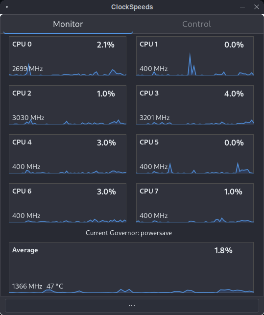
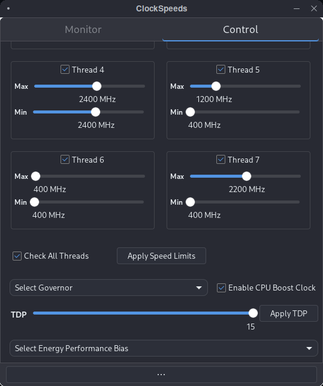

# ClockSpeeds CPU Monitoring and Control Application for Linux


This is a GUI application that allows you to monitor and control various aspects of the CPU on Linux systems.
This project is in early development so some things might not work as expected.

## Features

- **Real-time CPU Monitoring:** 
* Current CPU frequency per thread and average,
* Current CPU load per thread and average,
* Package temperature,
* Current selected governor



- **Control CPU:** 
* Adjust CPU the minimum and maximum frequencies,
* Select governor,
* Toggle boost,
* Change TDP,
* Set PBO offset curve (for AMD Ryzen CPU's only)



## Getting Started

Simply clone the repository with,

```sh
git clone https://github.com/Neol00/ClockSpeeds.git
```

then run,

```sh
cd ClockSpeeds
```

```sh
chmod +x ./install.sh
```

```sh
./install.sh
```

or run the application directly with.

```sh
python launch.py
```

When you launch the application the first time it creates a config.ini file inside your home directory's .config folder containing tunable settings 
that can be changed by changing the content of the config.ini file or inside the application.

## Prerequisites

What things you need to run the application and how to install them:

* python
* gtk4
* gobject-introspection
* python-gobject
* ryzen_smu (for AMD Ryzen CPU's full functionality only)

Arch Linux:

```sh
sudo pacman -S python gtk4 gobject-introspection python-gobject
```

If you are using a AMD Ryzen CPU i recommend that you download and install ryzen_smu manually from:
https://github.com/leogx9r/ryzen_smu

## License

This application is licensed under the GPLv3 License - see the LICENSE file for details.

## Support

For support or other inquiries, email: noelejemyr@protonmail.com
